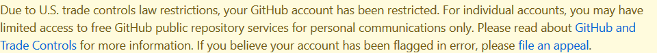

# Free GitHub

 

---
## What it does

This extension will hide the GitHub restrictions warn.

 

## Install

1. Directly install it from [Firefox Add-ons](https://addons.mozilla.org/en-US/firefox/addon/freegithub/)

2. Manually install it for Chrome:
-clone this repository
'''bash
git clone https://github.com/arsalanses/freegithub.git
'''
-Navigate to `chrome://extensions/`.
-Turn `Developer mode` on.
-Click on the `Load unpacked` button and load the extensions folder.

## Why this happend

Please read [GitHub blocked my account and they think I’m developing nuclear weapons](https://medium.com/@hamed/github-blocked-my-account-and-they-think-im-developing-nuclear-weapons-e7e1fe62cb74)

## Authors

* **Arsalan Sefidgar** - *Initial work* - [ArsalanSe](https://github.com/arsalanses)

See also the list of [contributors](https://github.com/arsalanses/freegithub/graphs/contributors) who participated in this project.

## License

This project is licensed under the MIT License - see the [LICENSE](LICENSE) file for details
